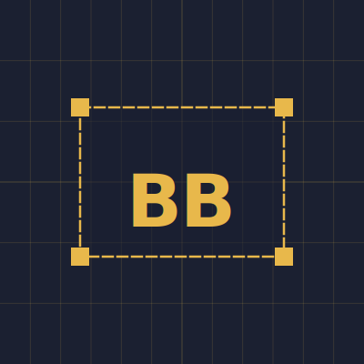

# BBoxer

<p align="center">
  
</p>

**Draw, snap & instantly copy AOI / bounding-box coordinates — in any EPSG.**

A zero-build, single-page web tool for the recurring pain point of grabbing the
coordinates of a bounding box or area of interest. Live on GitHub Pages.

**[Open BBoxer](https://pmuguda.github.io/bboxer/)** &nbsp;·&nbsp; **[Support on Ko-fi](https://ko-fi.com/pavan_muguda)**

[](https://github.com/pmuguda/bboxer/actions/workflows/pages/pages-build-deployment)
[](https://opensource.org/licenses/MIT)
[](https://maplibre.org/)
[](https://epsg.io/)

## Features

- Dark / Paper CARTO basemap with live theme toggle
- Draw a bounding box — click and drag a rectangle
- Draw a polygon — click vertices, double-click to close (bbox derived)
- Upload GeoJSON — renders the geometry and computes its bbox
- Country picker — hover to highlight, click to snap a bbox around any country
- EPSG transform — defaults to EPSG:4326; type any EPSG code (e.g. `32633`, `3857`) for on-the-fly reprojection
- One-click copy in multiple formats: array `[W,S,E,N]`, CSV, Python list, GDAL `-te`, and WKT polygon
- Precision slider — 0 to 8 decimal places
- Esc cancels any active draw or picker mode

## Coordinate formats

| Format | Example |
|--------|---------|
| Array | `[5.9, 47.2, 10.5, 55.1]` |
| CSV | `5.9,47.2,10.5,55.1` |
| GDAL `-te` | `-te 5.9 47.2 10.5 55.1` |
| WKT | `POLYGON((5.9 47.2, 10.5 47.2, ...))` |

## How it works

All client-side — no backend, no build step.

| Library | Version | Purpose | License |
|---------|---------|---------|---------|
| [MapLibre GL JS](https://maplibre.org/) | 5.24.0 | Interactive map rendering | BSD-3-Clause |
| [proj4js](http://proj4js.org/) | 2.15.0 | Client-side CRS / EPSG reprojection | MIT |
| [topojson-client](https://github.com/topojson/topojson-client) | 3.1.0 | TopoJSON to GeoJSON conversion | ISC |
| [world-atlas](https://github.com/topojson/world-atlas) | 2 | 110 m country boundary TopoJSON | BSD-3-Clause |
| [IBM Plex Mono / Sans Condensed](https://github.com/IBM/plex) | — | UI typefaces (via Google Fonts) | SIL OFL 1.1 |

**Data sources**

- [CARTO Basemaps](https://carto.com/basemaps/) — Dark Matter and Positron tile styles (free tier, attribution required)
- [epsg.io](https://epsg.io/) — proj4 CRS definitions fetched on demand
- [Natural Earth](https://www.naturalearthdata.com/) — 50 m breakaway / disputed area boundaries (public domain), via [nvkelso/natural-earth-vector](https://github.com/nvkelso/natural-earth-vector)

## Run locally

```bash
python3 -m http.server 8000
# then visit http://localhost:8000
```

## License

MIT — made by [Pavan Muguda Sanjeevamurthy](https://pmuguda.github.io)

## Acknowledgements

Developed with AI assistance (Claude by Anthropic) for code generation and debugging.
Architecture decisions, refinements, and ongoing maintenance by Pavan Muguda Sanjeevamurthy.
